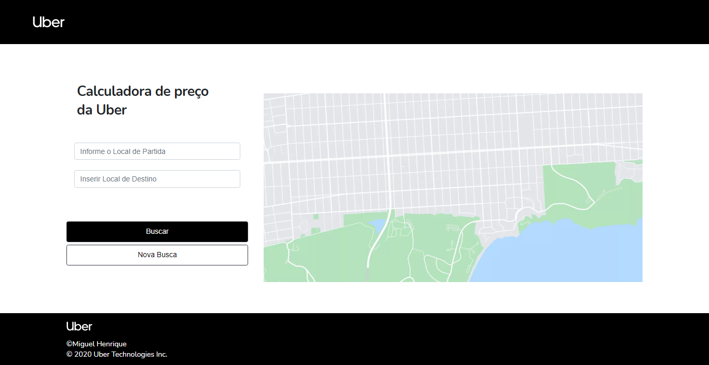

# Uber_Verificador_de_Precos

> APP Feito Para Verificar a Estimativa de Preços,
> De sua Viagem, Baseado Nas Tabela da UBER.

***
# :paperclip: Histórico de Versões

* Beta
    * FrontEnd Feito;
    * Teste API Local;
    * Hospedado;
    
* Alpha 1.0
    * API do Google Implantada, Mas Não Funcionando Do Jeito Correto;
* 1.0.1
    * Em Andamento
    * Implantar A API da MAPBOX
***
# 📝 License

Este projeto está licenciado sob a Licença MIT - consulte o arquivo [LICENÇA](LICENSE) para obter detalhes.

***

Feito com 💜 &nbsp;por Miguel Henrique 👋